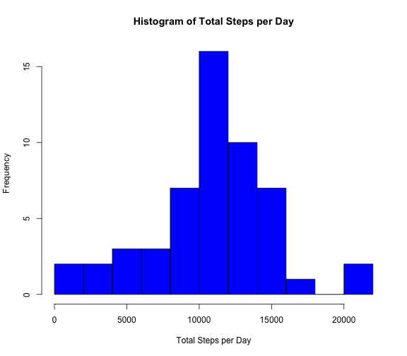
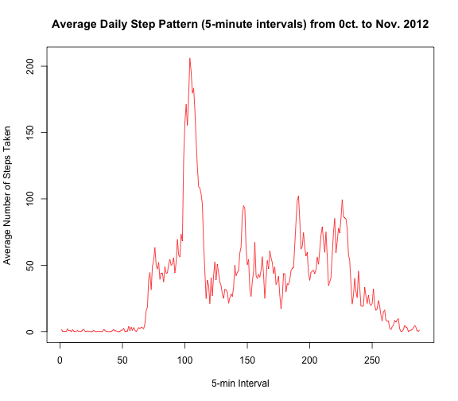
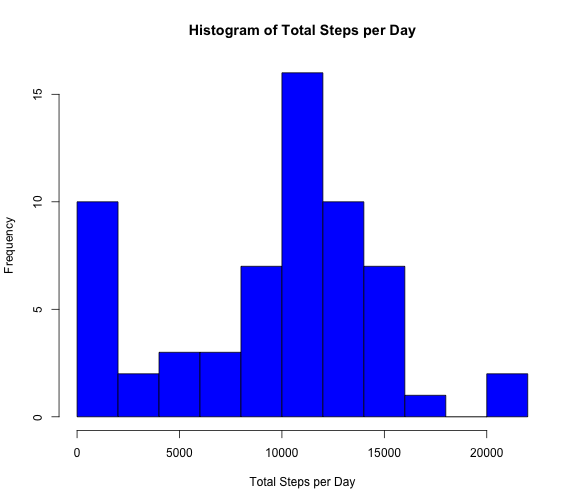

---
title: "Reproducible Research: Peer Assessment 1"
output: 
  html_document:
    keep_md: true
---   
This is the 1st project from the Coursera's Reproducible Research course.  

Using default `echo = TRUE` for the entire R markdown document.

## Loading and preprocessing the data  

1. This piece of code changes the directory into the working directory using `setwd()`, unzips with `unzip()` and loads the file with `read.csv()`.  

2. The `lubridate` package loaded is used to convert dates.  The `dplyr` package will be used for data table manipulation throughout.  I converted the interval type to  factor for future steps.  
  

```r
library (lubridate)
library (dplyr)  
setwd("~/Documents/Coursera_Data/ReproducibleResearch/RepData_PeerAssessment1")
unzip("activity.zip") 

activity <- read.csv("~/Documents/Coursera_Data/ReproducibleResearch/RepData_PeerAssessment1/activity.csv" )  

activity$date <-ymd(activity$date)  
activity$interval <-as.factor(activity$interval)  
```

## What is the mean number of steps taken per day?  

1. This code uses the `dplyr` package to calculate a new data table that utilizes
`summarize()` and `group_by()` to calculate Total steps per day for each interval.  I did not remove the `NA`s for the calculation of Total Steps as `hist()` appears to ignore the `NA`s when calculating the histogram.  If I remove the `NA`s from the `sum()` calculation, zeros are entered in the summarise table and the resulting histogram would not have the correct frequencies.  

2. I then calculated the mean and median using `mean()` and `median()` with `na.rm = TRUE` flag and reported the values below the Histogram.  


```r
stepsbyday <- summarize(group_by(activity, date),  
                            TotalSteps = sum (steps, na.rm = FALSE))
hist(stepsbyday$TotalSteps, 
        col= "blue",
        xlab = "Total Steps per Day", 
        main = "Histogram of Total Steps per Day",
        breaks = 8)  
```

 

```r
mean <- format(mean(stepsbyday$TotalSteps, na.rm = TRUE), digits = 5)  
median <- median(stepsbyday$TotalSteps, na.rm = TRUE)  
```
The mean is **10766** steps.  The median is **10765** steps.    

## What is the average daily activity pattern?  

1. I used `summarize()` and `group_by()` to average the number of step per 5-minute interval across the entire 2 month dataset. I then used `plot()` with `type = 'l'` to plot the average daily pattern in a time series line plot.

2. I used `max()` and `which.max()` to find out what the maximum number of steps was and when it was taken.  Values are reported below the line plot.  


```r
stepsbyinterval <- summarize(group_by(activity, interval), 
                             meansteps = mean(steps, na.rm = TRUE))
plot(as.numeric(stepsbyinterval$interval), stepsbyinterval$meansteps, 
     type="l",
     col= "red",
     xlab = "5-min Interval", 
     ylab = "Average Number of Steps Taken", 
     main = "Average Daily Step Pattern (5-minute intervals) from 0ct. to Nov. 2012")
```

 

```r
max_number <- round(max(stepsbyinterval$meansteps))  
max_interval_number <- which.max(stepsbyinterval$meansteps)  
```

The maximum number of steps (averaged across all days) is **206** steps and taken at interval **104**. 

## Imputing missing values  

1. This bit of code calculates the number of `NA`s in the dataset and reports it below the plot.  

2. My strategy for imputing missing values was to replace the `NA`s with the median for the entire data set.  

3. I copied the original dataset to a new name and then replaced `NA`s using `roughfix()` from the `randomForest` package.  `NA`s are replaced with the column median with this function, if numeric.    

4. I use the same steps as above to create a new histogram with the filled in `NA` dataset and then reported the mean and median values below.  


```r
missing <- sum(is.na(activity$steps)) 
percent <- format(missing/nrow(activity) * 100, digits = 2)
median_total <- median(activity$steps, na.rm = TRUE)

activity_no_na <- activity
activity_no_na <- tbl_df(activity_no_na)

library (randomForest)
activity_no_na$steps <- na.roughfix(activity_no_na$steps)

stepsbyday_no_na <- summarize(group_by(activity_no_na, date), 
                              TotalSteps = sum(steps))
hist(stepsbyday_no_na$TotalSteps,
     col= "blue",
     xlab = "Total Steps per Day",
     main = "Histogram of Total Steps per Day",
     breaks = 8)  
```

 

```r
mean_no_na<- format(mean(stepsbyday_no_na$TotalSteps, na.rm = FALSE), digits = 4)
median_no_na <- format(median(stepsbyday_no_na$TotalSteps, na.rm = FALSE ), digits = 5)
```

There are **2304** missing values in the dataset, which is **13%** of the data.  The mean when `NA`s are replaced with a median value of **0** is **9354** steps and the median is **10395** steps.  Both of these values are lower then the initial values of **10766** and **10765**.  

There are other strategies that could be used to replace the `NA`s.  This strategy happened to be the one I could implement without problems.

## Are there differences in activity patterns between weekdays and weekends?  

1. I used `wday()` from `lubridate` to identify the day of week. I then use `grepl()` to indicate if it's Saturday(7) or Sunday(1).  I convert weekend logical values from `TRUE` and `FALSE` into a factor with two variables, weekend and weekday.  

2. I used `lattice` package to plot but prior to plotting there is some data manipulation to be done.  I summed the number of steps, as above, with `summarise()` and `group_by()` and `sum()`.  After that I change interval to a numeric type.  These conversions were done to prior to plotting for plotting convenience.  All data manipulation was with the `NA` adjusted data. 


```r
activity_no_na$wday <- wday(activity_no_na$date)
activity_no_na$weekend <- grepl('1|7', activity_no_na$wday)

library (lattice)

stepsbyinterval_no_na <- summarize(group_by(activity_no_na, weekend, interval), 
                                   meansteps = mean(steps))

stepsbyinterval_no_na$weekend <- gsub('TRUE', 'weekend', 
                                      stepsbyinterval_no_na$weekend)

stepsbyinterval_no_na$weekend <- gsub('FALSE','weekday', 
                                      stepsbyinterval_no_na$weekend)

stepsbyinterval_no_na$weekend <- as.factor(stepsbyinterval_no_na$weekend)
stepsbyinterval_no_na$interval <- as.numeric(stepsbyinterval_no_na$interval)

xyplot(meansteps ~ interval | weekend, data = stepsbyinterval_no_na, 
       xlab = "Interval", 
       ylab = "Number of steps", 
       type = "l",
       layout = c(1, 2))
```

 

Yes, there are differences between weekend and weekday step patterns.  
   
**Note to peer reviewers.  I am new to markdown.  If there are things I could do to make the report more readable, please let me know.
